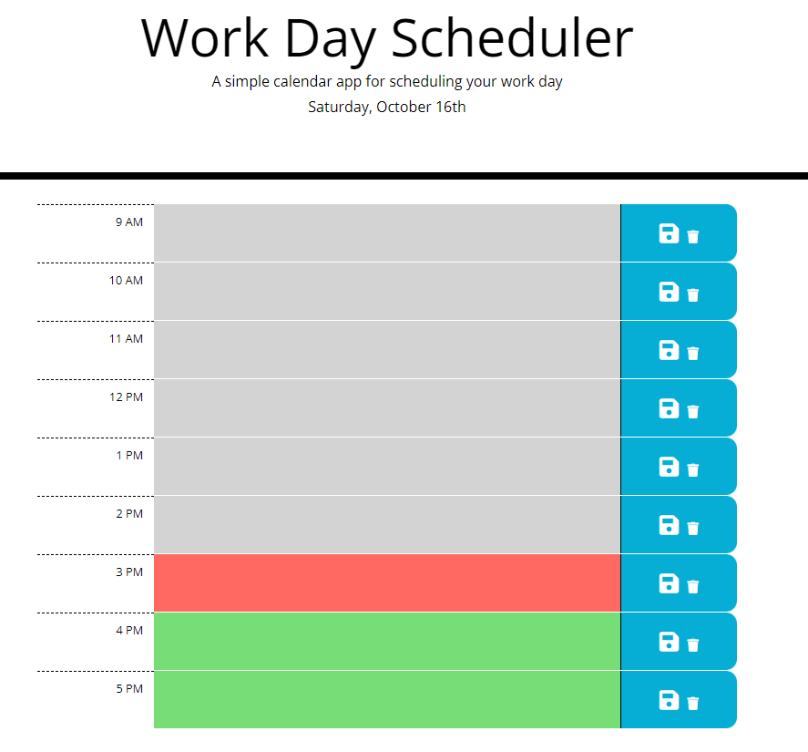

# Work Day Scheduler

### This calendar software for planning your workday was created to help me improve my abilities using third-party APIs.
> Developer tools used to make the workday scheduler:
- HTML
- CSS styling
- Javascript
- Bootstrap
- jQuery
- moment.js

### Application
[Work Day Assistant](https://matthewwalker333.github.io/work_day_scheduler/)

### Software Liscense: MIT

## Application Developer
***Matthew Walker***
#### Email: Matthewwalkermw64@gmail.com
#### Phone: (253)202-9604
